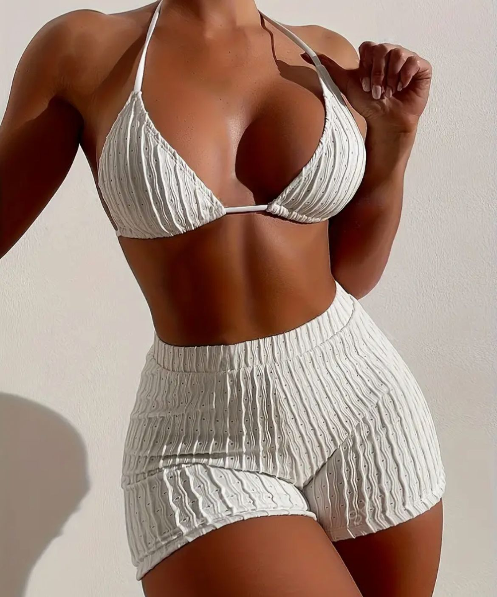
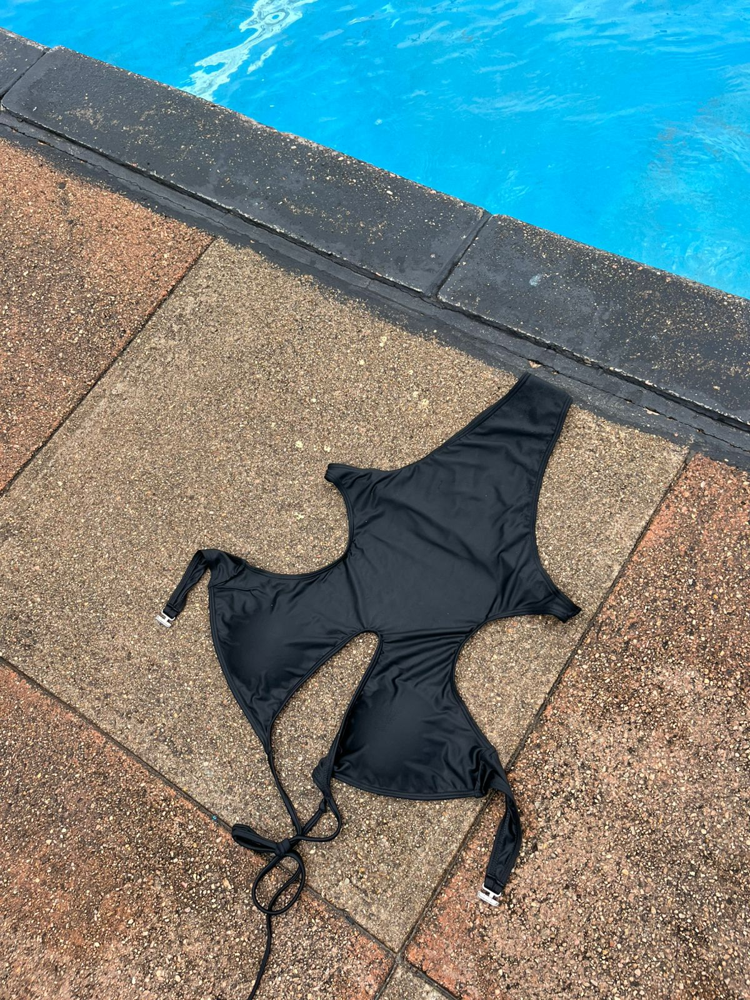
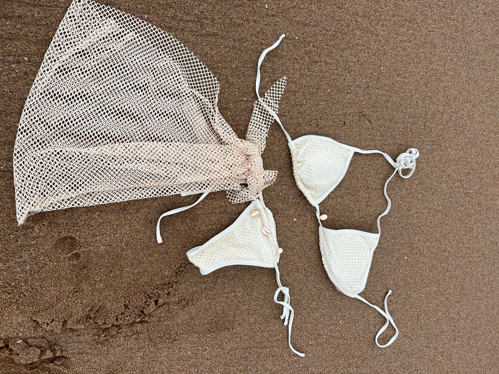
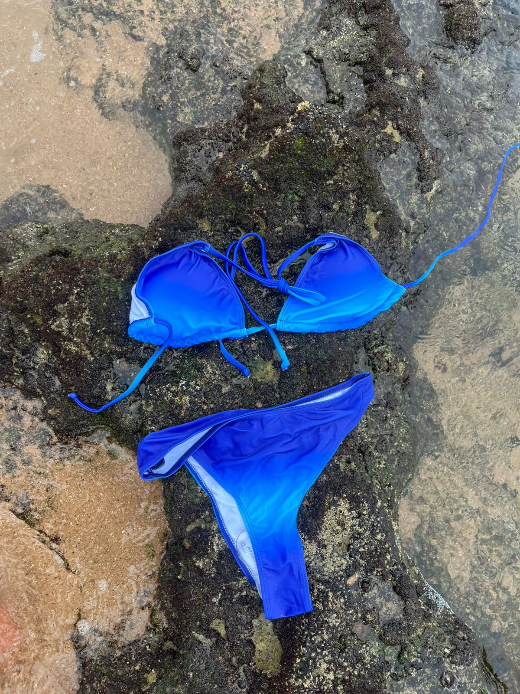
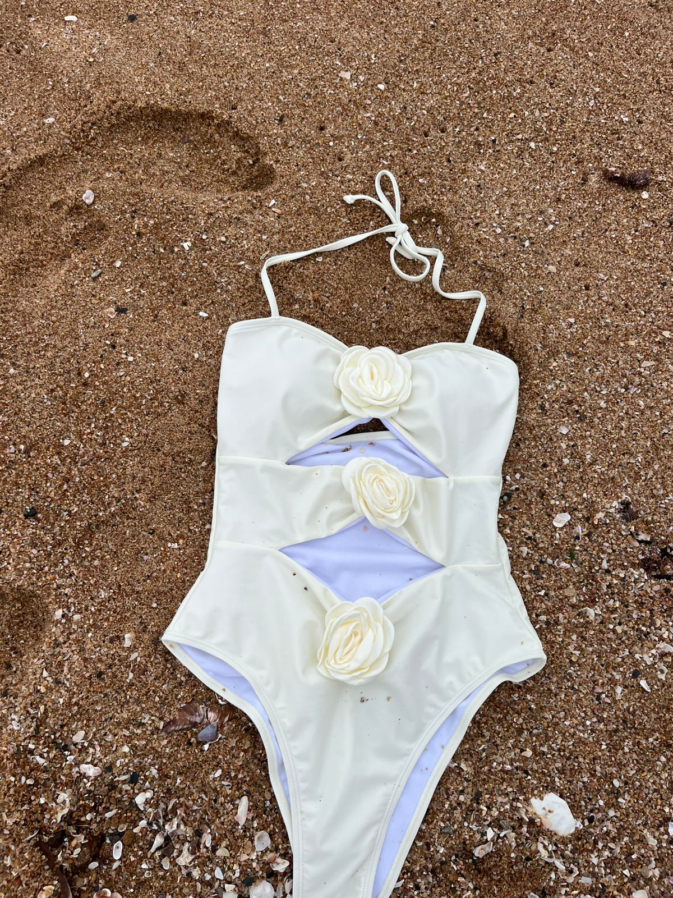
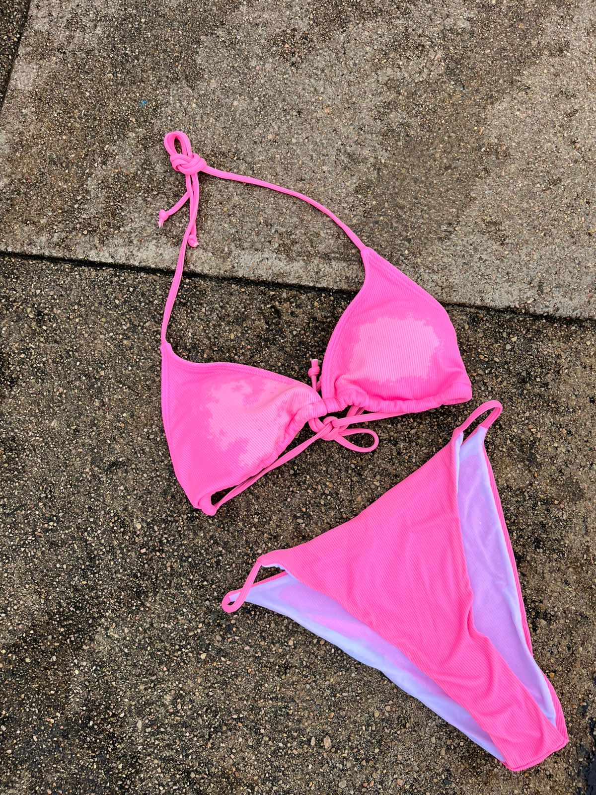

<!DOCTYPE html>
<html lang="en">
<head>
  <meta charset="UTF-8">
  <meta name="viewport" content="width=device-width, initial-scale=1.0">
  <title>Tidalswimwear</title>
  
</head>
<body>
  <header>
    <h1>👙 Tidalswimwear</h1>
    
We Love To See That!

  </header>
  <nav>
    <a href="#home">Home</a>
    <a href="#services">Services</a>
    <a href="#products">Products</a>
    <a href="#about">About Us</a>
    <a href="#contact">Contact</a>
  </nav>
  <main>
    <section id="home">
      <h2>Welcome to Our Business</h2>
      
The trendiest swimwear & vintage swimwear all in one stop.

    </section>
    <section id="services">
      <h2>Our Services</h2>
      
We provide authentic designs, high quality pieces for a very affordable price. As well as the personalization of each order to suit the customers body and likes &#x1F600;

    </section>
    <section id="products">
      

        <h2>Our Products</h2>
        &#x25BC; <!-- Down arrow -->
      

      

        <!-- Sandy -->
        

          
          <h3>Sandy</h3>
          
Two piece available in sizes S/M/L. Adjustable bra and stretchy bottom swim shorts.

          
<strong>R280</strong>

        

        <!-- AMAHLE -->
        

          
          <h3>AMAHLE</h3>
          
One-piece sexy stretchy swimsuit available in size S/M & XL.

          
<strong>R220</strong>

        

        <!-- SBAHLE SET -->
        

          
          <h3>SBAHLE SET</h3>
          
Three piece set. Classy swim wear available in size S/M/L.

          
<strong>R320</strong>

        

        <!-- Wave -->
        

          
          <h3>Wave</h3>
          
Blue two piece set available in size S & L. Adjustable and stretchy.

          
<strong>R199</strong>

        

        <!-- Bella -->
        

          
          <h3>Bella</h3>
          
One piece flower designed stretchy classy swimsuit. Available from size S - L.

          
<strong>R260</strong>

        

        <!-- Emma -->
        

          
          <h3>Emma</h3>
          
Two pink set. Padded bra (adjustable) & stretchy bikini bottom only available in size M.

          
<strong>R180</strong>

        

      

    </section>
    <section id="about">
      <h2>About Us</h2>
      
Gcina

    </section>
    <section id="contact">
      <h2>Contact Us</h2>
      
Email: gcinanatacha@gmail.com

      
Phone: 0672183602

      
Whatsapp: 0672183602

      
IG: @Tidalswimwearr

    </section>
  </main>
  <footer>
    
&copy; 2024 Tidalswimwear. All rights reserved.

  </footer>

  
</body>
</html>

